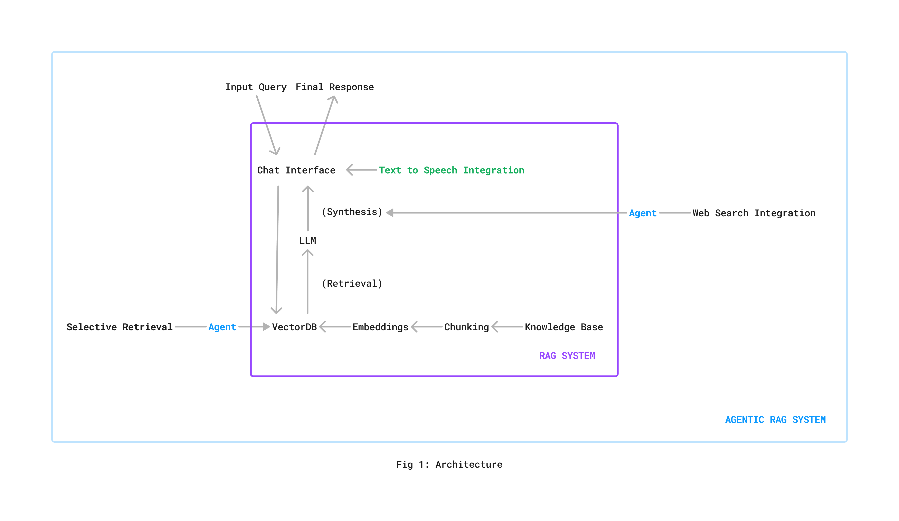
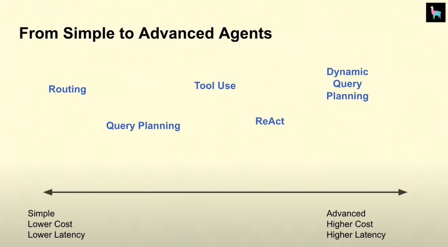
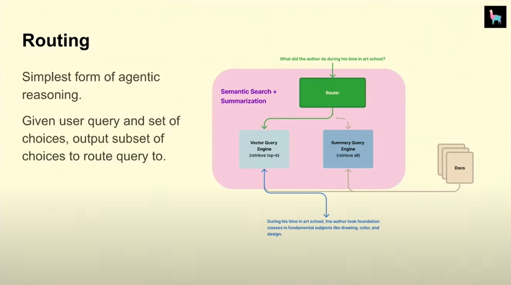

# **Agentic-RAG Implementation (Q/A-Based System)** 

Watch the video provided to see the results of several tests performed on its web app! https://youtu.be/Bs9V6aq1raE

[![Watch the video]](https://youtu.be/Bs9V6aq1raE)

This project implements a **Retrieval-Augmented Generation (RAG)** pipeline designed to answer questions based on the content of a knowledge base PDF. The system is enhanced with the agents that performs intelligent actions such as:

1. **Selective Retrieval**: The agent can decide when to query the Vector Database and when not to, based on the user's query.
2. **Web Search Integration**: Fetches relevant web links to provide additional resources related to user queries.

The **Text-to-Speech Integration** utilizes SarvamAI's API to convert text-based responses into speech for an improved user experience.



## **Knowledge Base**

The system is designed to retrieve and generate responses based on content from **Class 9th NCERT Science Textbook**, specifically focusing on **Chapter 11: Sound**. This chapter covers the fundamental principles of sound, including its production, propagation, characteristics, and behavior in different media. The knowledge base is built by processing the chapter's content into a retrievable format using natural language processing (NLP) techniques.

## **Tech Stack for the RAG System**

1. **Language Model**: ChatGPT Turbo-3 (OpenAI)
2. **Embeddings**: text-embedding-ada-002 (OpenAI)
3. **Vector Store**: Pinecone
4. **Customizable Chains**: LangChain for integrating various components of the RAG pipeline
5. **Web Framework**: FastAPI for building the application interface

## **Making of the Agents**

The Routing Algorithm is chosen for agent creation because the use case is straightforward and does not necessitate the use of a large language model (LLM) for decision making. For example, in Selective Retrieval, most queries contain generic keywords. Even if a small fraction of queries are not addressed, the trade-off of employing an LLM for every decision is significantly greater than the minimal failure rate in this context.

 



[(Source of Fig 2 and Fig 3)](https://youtu.be/aQ4yQXeB1Ss?si=972eIHd_H6rKX06u)

1. **Agent for Selective Retrieval**

It utilizes regular expressions to search for exact matches within the query. The process involves:

- Converting both the query and keywords to lowercase for case-insensitive matching.
- Utilizing the `re.search()` function to identify whole words in the query, with `\b` ensuring word boundaries.
- Returning `True` if any keyword matches, indicating relevance to the domain; otherwise, it returns `False`.
- If `True`, the query invokes the chain for response generation; if `False`, it does not invoke the chain and instead returns the message, "The query is not relevant to Chapter 11: Sound."

2. **Agent for Web Search Integration**

It facilitates querying the Google Custom Search API and retrieving relevant links based on user input. It  consists of two classes: GoogleSearchClient and SearchManager.

- **Classes**:
  - **GoogleSearchClient**:
    - Initializes with an API key and search engine ID from environment variables.
    - Offers the `search(query, num_results=3)` method, encoding the query, constructing the API URL, and sending a GET request to return a list of links or an empty list if no results are found.
  
  - **SearchManager**:
    - Wraps the `GoogleSearchClient`.
    - Contains the `get_search_results(query)` method to retrieve search results or return a "No results found" message.

## **Usage**

1. **API Key Initialization**:  
   Add the following API keys to a `.env` file. The notebook uses the `dotenv` library to securely load these keys for API interactions.

   Example `.env` file:
   ```python
   OPENAI_API_KEY="your_openai_api_key"
   SARVAMAI_API_KEY="your_sarvamai_api_key"
   PINECONE_API_KEY="your_pinecone_api_key"
   PINECONE_API_ENV="your_pinecone_environment"
   SEARCH_ENGINE_ID="your_search_engine_id"
   CUSTOM_SEARCH_API_KEY="your_custom_search_api_key"

2. **Run the Notebook**: 
   Follow the steps in the notebook to install libraries, initialize models, and process PDFs for document retrieval.

3. **Access the Application**:
   Once the notebook is running, navigate to http://localhost:8000/ or http://127.0.0.1:8000/ to access the application interface.

4. **Interacting with the System**:
    After accessing the application, input queries, and the system will retrieve relevant information and generate appropriate responses.

## **Future Scope**

Implement LangChain and LangGraph to develop intelligent agents within the ReAct framework, utilizing the multi-tool feature that enables the integration and execution of various tools defined in a Python list.